## Einführung

Die Wallfahrt ist älter als das Christentum. Bereits im Alten Bund war das Pilgern zu heiligen Stätten üblich; viele Psalmen waren ursprünglich Wallfahrtslieder. Bekannt ist auch die Wallfahrt des zwölfjährigen Jesus mit seinen Eltern zum Tempel in Jerusalem. Auch andere Religionen kennen die Pilgertradition, etwa die Wallfahrt der Muslime nach Mekka.

Anlass für Pilgerinnen und Pilger ist meist das Vortragen gemeinsamer oder persönlicher Anliegen: die Bitte um Abwendung irdischer oder seelischer Not, der Dank für erfahrene Hilfe oder ein sichtbares Zeichen des Glaubens.

Mehr als die Hälfte aller Wallfahrten im Bistum Passau sind der Gottesmutter geweiht. Die berühmteste ist die Wallfahrt nach Altötting, deren Ursprung wahrscheinlich in das Jahr 1489 fällt. Weitere bedeutende und teils ältere Orte sind Kößlarn (1364), Niedergottsau (1400) und St. Nikola (vor 1450). An diesen Orten wird das Gnadenbild meist als stehende Maria mit dem Jesuskind im Arm verehrt.

Die Blütezeit der Marienwallfahrten war die Gegenreformation, die sich im deutschen Raum während und nach dem Dreißigjährigen Krieg (1618–1648) auswirkte. In dieser Zeit entstanden auch Kirchen mit Vesperbildern: Pietà-Darstellungen der Muttergottes mit dem Leichnam Jesu im Schoß und der Mater Dolorosa, der Schmerzhaften Mutter, im Hochaltar. Klassische Beispiele barocker Vesperbilder im Bistum Passau finden sich in Obernzell, Sammarei, Kößlarn, Postmünster, am Gartlberg in Pfarrkirchen und in Atzberg. Die Kirche von Atzberg wurde 1680 vom selben Baumeister wie die Gartlberger Kirche errichtet.

---

## Geschichtlicher Hintergrund

Entlang uralter Pilgerwege aus dem Rottal nach Altötting stehen zahlreiche Kapellen. Meist sind es Marienkirchen, die die Pilger auf das Ziel ihres Weges hinweisen. Atzberg war dabei Rastplatz auf dem Weg nach Altötting und zugleich ein eigenes kleines Wallfahrtsziel für die Gläubigen der Umgebung.

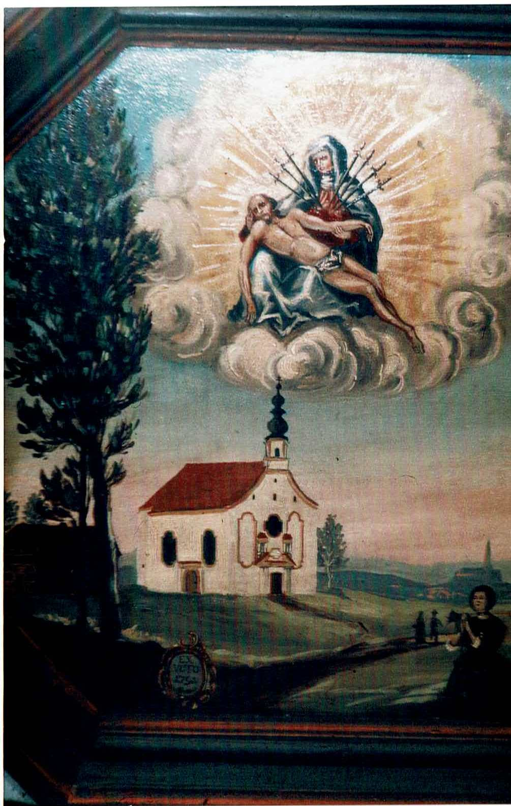{width=60%}

Die Kapelle Mariä Himmelfahrt von Atzberg, früher auch Arzberg bei Mitterskirchen genannt, liegt an der Grenze zu Oberbayern. Unmittelbar daneben verlief die frühere Bundesstraße 588, die in den Jahren 1832 bis 1834 als kürzeste Verbindung von Eggenfelden über Atzberg und Reischach nach Altötting ausgebaut wurde. Die Erbauer wählten einen markanten Punkt: eine Anhöhe hoch über dem Tal der Gera, die der Rott entgegenfließt. Von dort sieht man den Kirchturm der ehemaligen Mutterpfarrkirche Hirschhorn; im Osten liegt, noch höher, die Pfarrkirche von Wurmannsquick. Gut einen Kilometer nördlich befindet sich die Pfarrkirche Mitterskirchen, zu der die Nebenkirche Atzberg gehört.

Das Atzberger Marienheiligtum ist ein bescheidenes und doch bemerkenswertes Kircherl. Seine Ausmaße sind klein, doch für eine ländliche Kapelle ist die Fassade ungewöhnlich reich gegliedert.

Die Geschichte der Wallfahrt nach Atzberg hängt zum einen mit dem vorbeiführenden Pilgerweg zusammen, einem früher einfachen Weg nach Reischach und Ötting, der direkt an der Kirche vorbeiführte und durch bewaldetes Gebiet verlief. Zum anderen zeigt der linke Seitenaltar heute den Rottaler Heiligen Bruder Konrad. Sein Bildnis wurde nach der Heiligsprechung 1934 anstelle des früheren St.-Georgs-Bildes angebracht, das auf die adeligen Stifter der Kirche hinwies. Auch viele Votivtafeln aus dem 18. Jahrhundert bezeugen die Verbindung der Pilger mit der Muttergottes von Altötting.

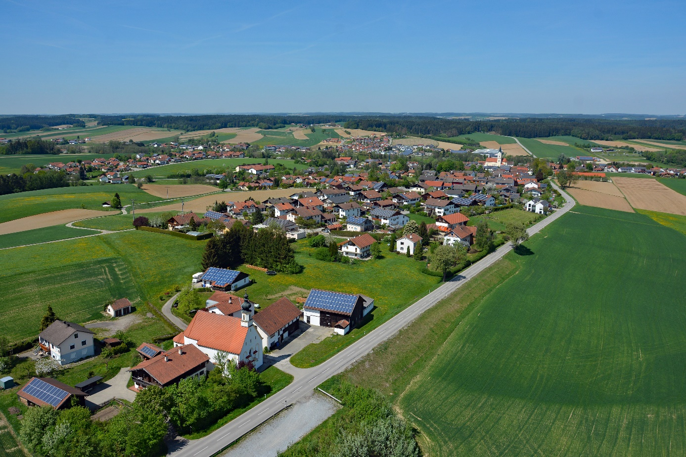

Der Name Atzberg geht nach Emil Wulzinger[^wulzinger] vermutlich auf einen Siedler namens Azo zurück. Nach Hans Karlinger[^karlinger] waren die Ritter „de Arzberg“ Zeitgenossen der Edlen von Mitterskirchen, die seit 1168 nachweisbar sind. Auf dem bewaldeten Hügel hinter der Kirche fanden sich noch 1878 nach dem 1893 verstorbenen Mesner Johann Baptist Straßner[^strassner] schwache Spuren einer einstigen burgartigen Anlage. Die von 1120 bis 1210 beurkundeten Adligen waren nach Bartholomäus Spirkner[^spirkner] Ministeriale der Grafen von Gern.

Im 12. Jahrhundert erscheinen die Ritter „de Atzberg“ auch in Urkunden der Klöster Au und Weltenburg. Letztmals findet sich das Geschlecht in diesen Klöstern in einer Tauschurkunde aus dem Jahr 1495. Im 17. Jahrhundert ging Atzberg auf das Geschlecht von Wening-Ingenheim mit Stammsitz in Hirschhorn über.

1893 veröffentlichte Expositus Johann Ev. Mader[^mader-johann] ein elfseitiges Heft mit dem Titel „Die Wallfahrt zur schmerzhaften Mutter Gottes in Atzberg“. Verfasst hatte es der Atzberger Mesner Johann Baptist Straßner. Er war ein großer Verehrer der Gottesmutter von Altötting. An seinem Sterbetag, dem 26. April 1893, notierte Mader Straßners letzte Worte: „Jetzt ergreift mich ein recht starkes Verlangen, eine Sehnsucht, bald meinen gütigen Gott und die liebe Himmelsmutter zu sehen.“

Die Entwicklung der Wallfahrtskirche Atzberg ist eng mit der Entstehung einer Klause und später des Mesnerhauses verbunden.

---

## Einsiedelei und Mesnerhaus

Pfarrer Mader, seit 1893 Expositus und von 1897 – 1927 Pfarrer in Mitterskirchen berichtet über die Klausnerei und das Mesnerhaus, das im Jahre 1984 an den derzeitigen Eigentümer verkauft und von ihm grundlegend zu seinem Wohnhaus renoviert wurde.

Seit dem 12. Jahrhundert nach den Grafen von Arzberg finden sich in Kirchenrechnungen und Visitationsberichten der Urpfarrei Hirschhorn folgende Besitzverhältnisse:

1643 wurde nach der Genehmigung der Grafen eine Einsiedelei mit einer KLausnerkapelle aus Holz errichtet. Da die Kapelle sehr mit Moos bewachsen war nannten sie die vorbeiziehenden ersten Wallfahrer das Mies(Moos)kirchlein. In der Klausur durften Arzneimittel zubereitet und verabreicht werden.

Der Visitationsbericht[^visitationsbericht] von 1672 berichtet vom Einsiedler Georg Sennhuber: 

> Der Einsiedler **Georg Sennhuber**, 47 Jahre alt, versieht mit einem krumpen Bauernknecht die Kapelle, liegt alle Nächte in einer Totenbare, trinkt kein Bier und ist niemandem mit Sammeln lästig.

Nach dem heutigen **Kapellenbau im Jahre 1680** war der Einsiedler sicher auch der erste Mesner. In diese Zeit fällt auch der ursprüngliche Bau des Mesnerhauses. Vermutlich wurde die einfache Einsiedelei dabei aufgegeben.

Nach dem Tod dieses Eremiten im Jahre 1693 versieht bis 1697 der 34 Jahre alte **Frater Lambert** seinen Dienst. 

Erst Anfang des 19. Jahrhunderts wird als **letzter** Eremit der 24 jährige Frater Christoph Frühgruber genannt, der bis zur Säkularisation im Jahre 1803 seinen Dienst versehen konnte.

---

## Die Wallfahrtskirche (Baujahr 1680)

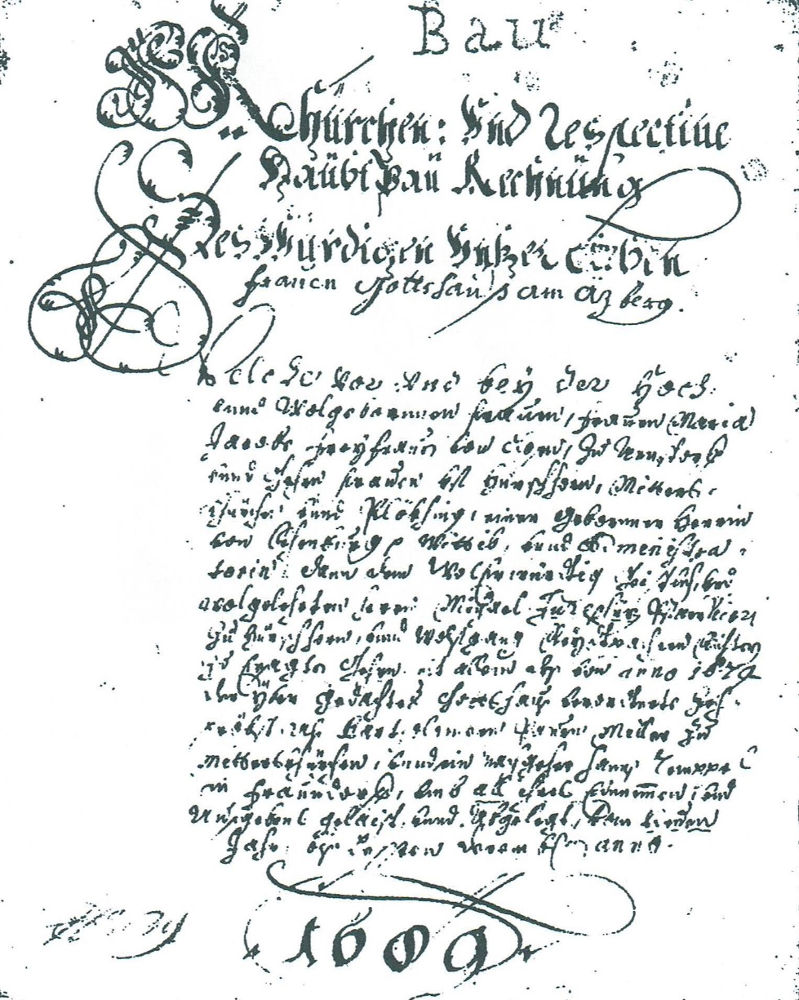{width=60%}

Der Bau der heutigen Wallfahrtskirche ist genau belegt. Nach einer Stiftungsurkunde ließen die Herren von Wening-Ingenheim auf Hirschhorn die Kirche im Jahr 1680 erbauen; dazu liegt auch eine Hauptbaurechnung vor. Beschrieben wurde die Kirche von verschiedenen Kunstkennern, aber auch von einfachen Leuten: unter anderem vom Mesner Johann Baptist Straßner, von Expositus und späterem Pfarrer von Mitterskirchen Johann Mader, vom Kunstreferenten der Diözese Passau Felix Mader[^mader-felix] und von Hans Karlinger, der 1923 die Kunstdenkmäler des Bezirksamtes Eggenfelden beschrieb. Auch Dr. Jörg Haller[^haller] befasste sich 2007 im Auftrag des Bayerischen Rundfunks für das „12-Uhr-Läuten“ mit der Wallfahrtskapelle.

Die geschichtliche Situation zur Erbauungszeit erklärt die Motivation der Adeligen Wening-Ingenheim, in Hirschhorn und Atzberg eine Muttergotteskirche zu fördern. Eine Generation nach dem Ende des Dreißigjährigen Krieges und in der Zeit der Türkenbedrohung, die 1683 bei Wien von christlichen Heeren zurückgeschlagen wurde, suchte die Bevölkerung Trost in gut zu Fuß erreichbaren Gotteshäusern.

### Architektur

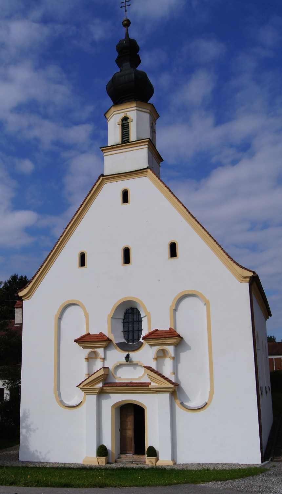{width=60%}

Der barocke Kirchenbau blieb bis heute im Wesentlichen unverändert. Einschließlich Sakristei ist die Kirche 26,19 m lang und 10,70 m breit. Die Firsthöhe des Kirchenschiffs beträgt 14,40 m, die Höhe bis zur Oberkante des Kreuzes 24,43 m. Im Kuppelturm hängen zwei Glocken. Die größere Glocke von 1687 wurde 1877 durch eine neue, dem hl. Sebastian geweihte Glocke ersetzt; sie wurde von Ludwig Strasser aus Burghausen gegossen. Die kleine Marienglocke von Josef Huber aus Braunau kam 1710 hinzu. Im Ersten Weltkrieg wurden beide Glocken für Kriegszwecke eingeschmolzen. Die größere Glocke konnte 1922 durch den damaligen Ortspfarrer Mader wieder finanziert werden, die kleinere wurde 1950 durch eine Bruder-Konrad-Glocke ersetzt.

1835 errichtete die Patrimonial-Stiftung Wening-Ingenheim von Hirschhorn einen Zufahrtsweg und eine Treppe zur Kirche. Nach dem umfangreichen Straßenbau in den 1830er-Jahren liegt die Kirche heute tiefer als die Straße.

Dr. Michael Zauner[^zauner] beschreibt die reich gegliederte Ostfassade mit:

- einen gesprengten Giebel über dem Portal,
- drei barocke Fensternischen, von denen nur die mittlere ihrem Zweck dient,
- zwei überdachte Nischen beiderseits über dem Eingang, in denen einst Figuren des hl. Georg und des hl. Rochus standen,
- ein Portal mit kräftigen Pilastern sowie großformatige Blendarkaden, die die Fensterformen wiederholen.

Der hl. Rochus, ein Pilgerpatron, weist auf die Funktion der Kirche als Stationskirche auf dem Weg nach Altötting hin. Der verschwundene Ritterpatron St. Georg erinnert an Geschichte und Herkunft des Kirchleins. Die Figuren wurden in den 1980er-Jahren von Kirchenschändern geraubt.

In der Mitte der Ostfassade wächst der gefällige Dachreiter mit Kuppelkrönung auf. Das im Verhältnis zu den schmalen drei Fensterachsen breite Innere wird an den Wänden durch Pilaster mit kräftigen, verkröpften Gebälkstücken gegliedert. Durch die oben und unten ausgerundeten Fenster fällt reichlich Licht in den Raum. Der ausgerundete Chorbereich ist deutlich abgesetzt; den Raum überspannt ein angedeutetes Kreuzgratgewölbe, in das von den Fenstern her tiefe Stichkappen einschneiden.

---

## Innenraum und Ausstattung

Nach dem Eintreten fällt zunächst ein schmiedeeisernes Gitter aus dem späten Barock ins Auge. In seinem oberen Teil befindet sich eine auf Blech gemalte Darstellung des Gnadenbildes von Altötting aus dem Jahr 1755. Sie weist darauf hin, dass Atzberg nicht nur ein Wallfahrtsziel der Umgebung war und ist, sondern auch eine Stationskapelle für Pilgerinnen und Pilger auf dem Weg nach Altötting. Bei der Renovierung zur 300-Jahr-Feier 1980 wurde das Gitter so weit zurückgesetzt, dass Besucher den Raum nach Öffnung des Portals betreten können, wertvolle Ausstattungsteile aber besser geschützt bleiben.

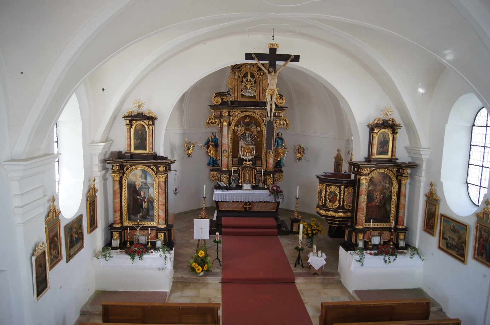

Die Ausstattung stammt einheitlich aus der Erbauungszeit. Hauptaltar und Seitenaltäre sind zweisäulige Barockaufbauten mit Knorpeldekor. Am polygonalen Korpus der Kanzel mit reichem Akanthusdekor sind in Ölbildern die vier Evangelisten dargestellt. Unter der Kanzel befindet sich das Wappen der Erbauer, der Freiherren von Closen.

### Hauptaltar

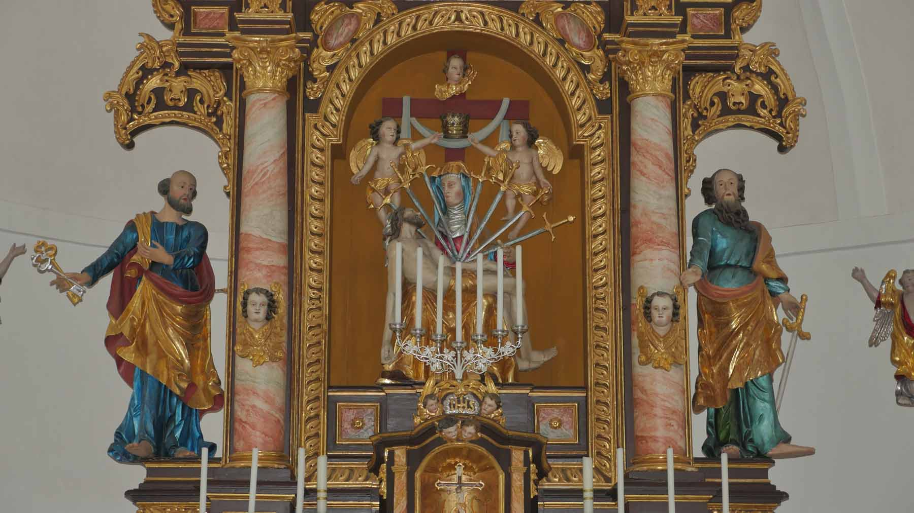

In der Mittelnische des Hauptaltares steht das Gnadenbild der Kirche: eine bemerkenswerte Pietà. Sie bildet die Herzmitte des Gotteshauses. Sieben Schwerter fahren in das Herz der Muttergottes und symbolisieren die sieben Schmerzen Mariens. Darüber halten Engel die Krone für die Himmelskönigin.

Als „Schreinwächter“ flankieren die Apostel Petrus links und Paulus rechts unter Baldachinen den Altar. Zusätzlich bereichern zwei an der Wand befestigte Leuchtengel den Altarraum. Bemerkenswert ist auch die Ausrichtung der Kirche in der Ost-West-Achse: Der Hauptaltar befindet sich nicht wie üblich an der Ost-, sondern an der Westseite.

Die Altarblätter der Seitenaltäre zeigen links den Heimatheiligen Bruder Konrad, der nach der Heiligsprechung 1934 das frühere Bild des hl. Georg ersetzte. Dieses St.-Georgs-Bild ist seither über dem Südportal angebracht. Der rechte Seitenaltar zeigt den hl. Antonius von Padua.

### Kruzifix

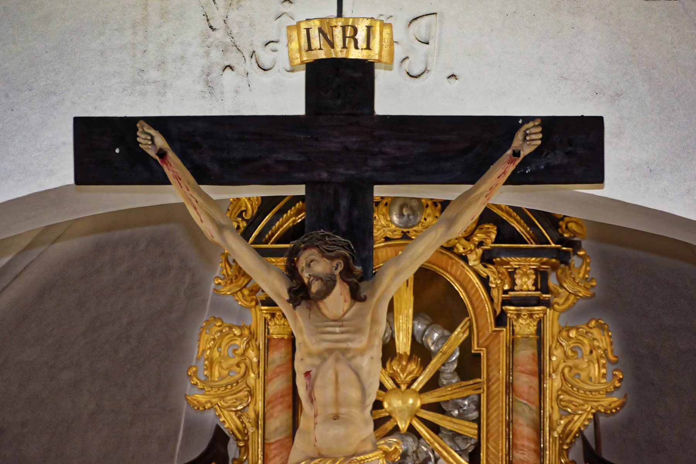

Eine bemerkenswerte Arbeit ist das Chorbogen-Kruzifix. Es zeigt die Nagelung durch die Hände in realistischer Weise – eine Darstellung, die seit den frühen Kreuzigungsdarstellungen ab dem 6. Jahrhundert eher selten ist. Der Künstler dieser Skulptur und der meisten weiteren Kunstwerke der Kirche sind laut Kunstreferat Passau unbekannt. Auffällig ist, dass alle Kruzifixdarstellungen in der Kirche dieselbe Nagelung zeigen.

### Empore

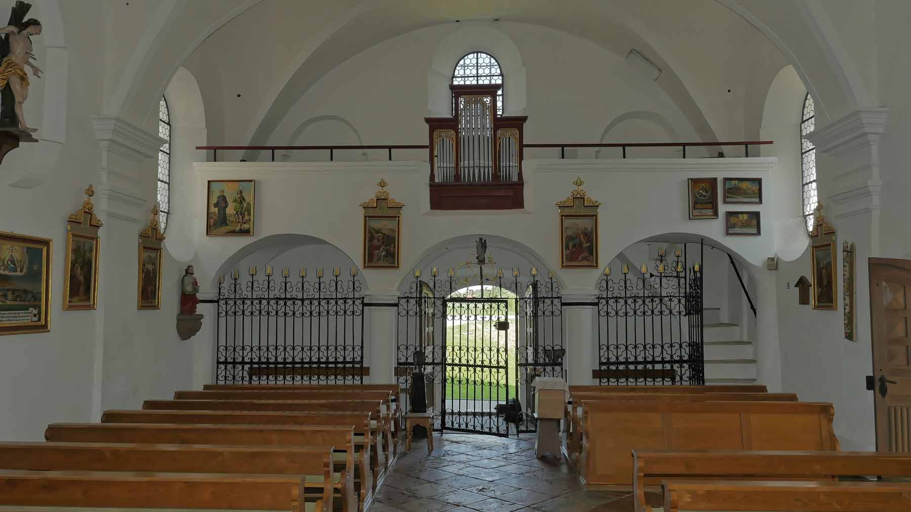

Die Empore vor der Ostwand ruht auf zwei Rundstützen. In die Brüstung ist eine Orgel mit fünf Registern eingefügt. An den Seitenwänden hängen Kreuzwegbilder im Nazarenerstil von Michael Zattler. Die Stationen 5 und 10 wurden 2025 von Dipl.-Restaurator Ulrich Weilhammer restauriert.

---

## Votivbilder

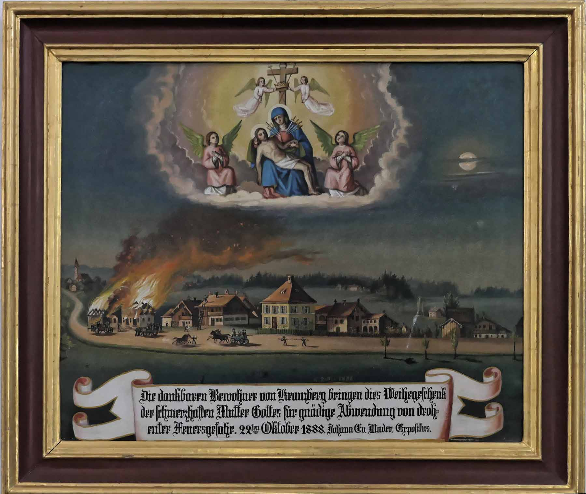

Zahlreiche großformatige und aufwendige Votivbilder in der Kirche bezeugen das tiefe Vertrauen der Bevölkerung in die segnende und heilspendende Kraft der Muttergottes von Atzberg. Ein Bild stifteten die Bewohner des nahen Fleckens Kranzberg im Jahr 1888 zum Dank für einen glücklichen Ausgang aus Feuersnot. Ein anderes stammt von vier jungen Männern aus der Umgebung, die für ihre glückliche Rückkehr aus dem Feldzug gegen Frankreich 1870/71 dankten.

Diese Bilder stammen von dem begnadeten Maler Michael Zattler aus Wurmannsquick. Er schuf für zahlreiche Kirchen der weiteren Region Bilder, Kreuzwegbilder und Kirchenausmalungen.

---

## Figuren und Details

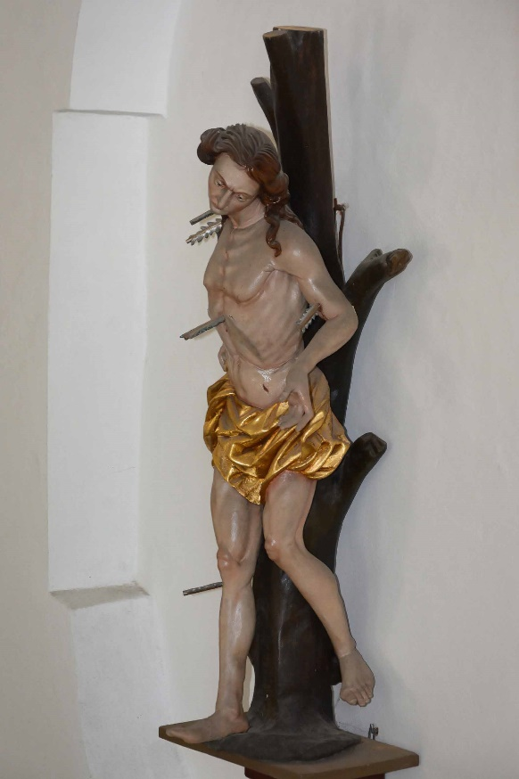{width=60%}

An der Nordwand steht eine harmonisch geformte Figur des hl. Sebastian. Nicht übersehen sollte man auch das Marmorpflaster aus der Erbauungszeit, das viele Tritte unserer Vorfahren und Wallfahrer erlebt hat. Die außerordentlich gut erhaltene Bausubstanz und Inneneinrichtung beweisen, dass den etwa elf Generationen vor uns kein Opfer zu groß war, dieses Kleinod zu erhalten.

Rechts neben der Kirche befand sich noch bis ins 18. Jahrhundert ein Bierkeller, wohl für die Wallfahrer bestimmt. Wegen Streitigkeiten zwischen den Wirten von Mitterskirchen und Reischach ließ das Bezirksgericht Eggenfelden den Bierausschank schließen. Auf der rechten Kircheninnenseite zeigt eine flache Nische noch, dass hier ein direkter Ausgang zum Bierkeller bestand.

---

## Renovierungen

Belegt sind Renovierungen in den Jahren 1866, 1930, 1980 bis 1984 sowie 2025. Im Jahr 2025 erfolgten eine umfangreiche Dachstuhl- und Innenrenovierung mit bemerkenswerten ehrenamtlichen Leistungen unter der Leitung von Dipl.-Ing. Josef Peindl.

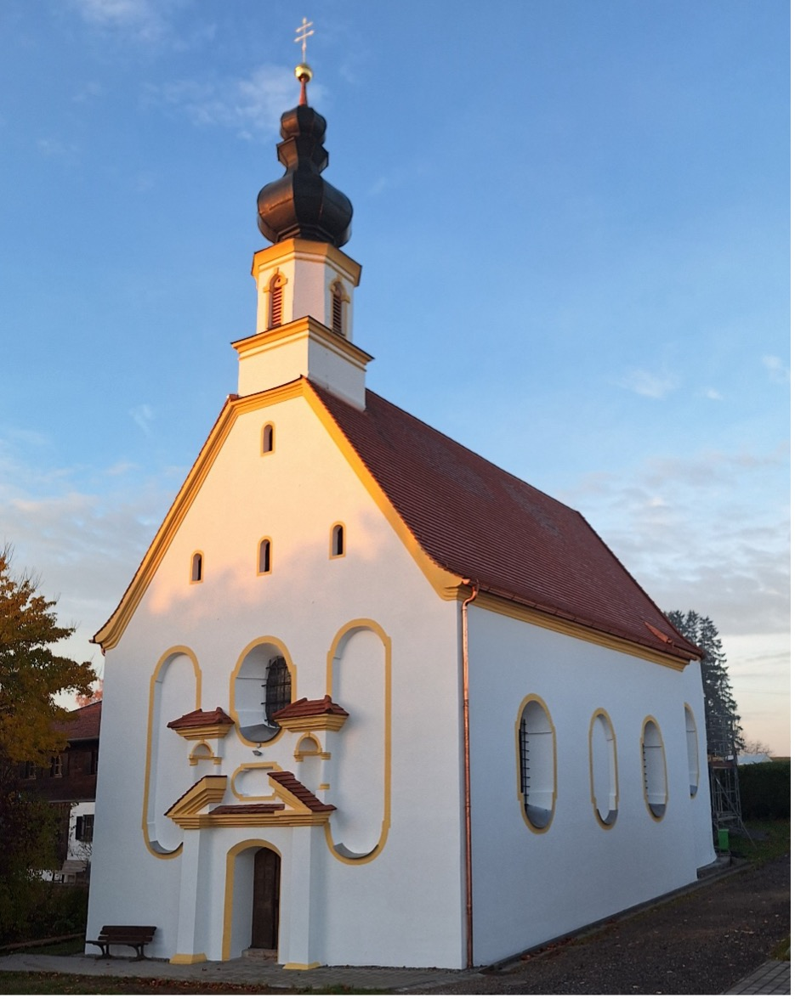

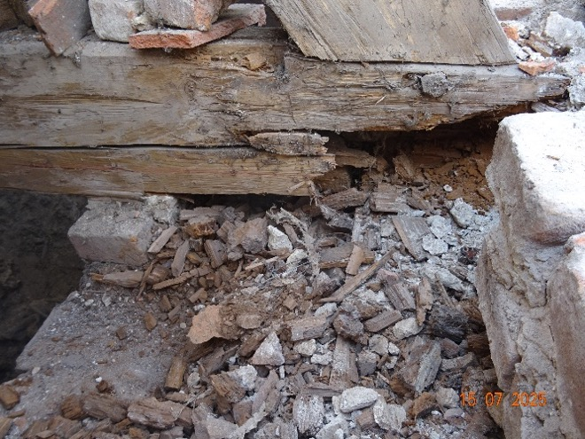{width=60%}

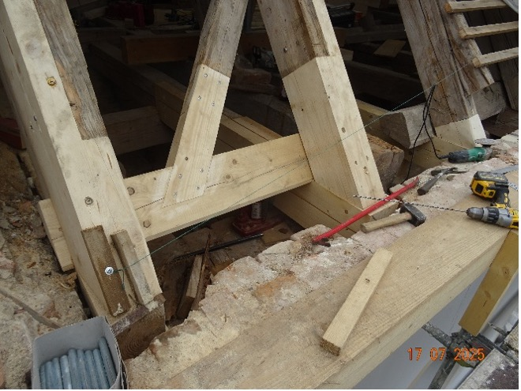{width=60%}

---

## Liturgie und Wallfahrt

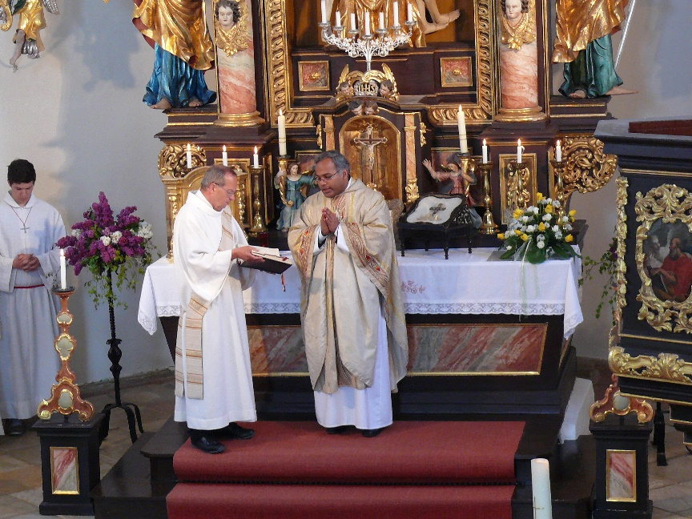

In früheren Zeiten fand vom „Schmerzhaften Freitag“ bis „Maria Opferung“ jeweils am Freitag ein Gottesdienst statt, der von Mitterskirchen aus versehen wurde. Zum Kirchenpatrozinium Mariä Himmelfahrt hält bis heute der jeweilige Pfarrer von Hirschhorn den Festgottesdienst. An den drei „Goldenen Samstagen“ kamen noch um 1930 zahlreiche Beichtleute nach Atzberg.

Viele für die Kirche von Atzberg eingegangene Messintentionen bezeugen das große Vertrauen der Bevölkerung zu diesem Gnadenort der Muttergottes auf dem Weg nach Altötting, wie ihn der 1893 verstorbene Mesner Straßner bezeichnete.

---

## Pilgerstempel

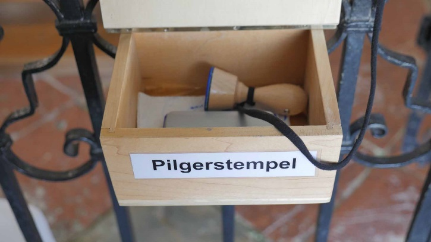

Am Kircheneingang gibt es seit 2016 einen Pilgerstempel, der von Wallfahrerinnen und Wallfahrern erfreut angenommen wird. Er wurde von Mesnerin Marianne Mayer initiiert und von Dr. Michael Zauner in Auftrag gegeben.

---

## Literatur und Quellen

[^wulzinger]: Wulzinger

[^karlinger]: Karlinger

[^strassner]: Straßner

[^spirkner]: Spirkner

[^mader-johann]: Mader

[^visitationsbericht]: Visitationsbericht

[^mader-felix]: Mader Felix

[^haller]: Haller

[^zauner]: Zauner

1. Wulzinger, Emil: *Beschreibung des Bezirksamtes Eggenfelden*, 1878
2. Karlinger, Hans: *Die Kunstdenkmäler von Niederbayern*, 1923
3. Straßner, Johann Baptist: *Die Wallfahrt zur schmerzhaften Muttergottes zu Atzberg*, 1893
4. Spirkner, Bartholomäus: *Besiedelung des Amtsgerichtsbezirks Eggenfelden*, 1907
5. Mader, Johann Ev., Expositus und Pfarrer von Mitterskirchen, 1893
6. Visitationsbericht der Pfarrei Mitterskirchen
7. Mader, Felix: *Die Kunstdenkmäler von Bayern*, 1923
8. Haller, Jörg: „12-Uhr-Läuten aus Atzberg in Niederbayern“, BR 1, 06.05.2007
9. Zauner, Michael: *Pfarrchronik Mitterskirchen*, 1997
10. Bauurkunde von Atzberg, 1680, Diözese Passau
11. Handbücher des Bistums Passau
12. Hartmann, Maximilian: *Großpfarreien*, Handbuch, KD Eggenfelden, Kriß II, 44
13. Schlicht, Josef: *Niederbayern in Land, Geschichte und Volk*, 1808
14. Urkunde der Hl. Kapelle, Altötting
15. Visitationsberichte der Diözese Passau
16. Vogl, Albert: *Heimatbuch Hirschhorn*
17. Wenning, Michael: *Rentämter*, 1725
18. Zauner, Michael: „Atzbergs besonderes Kreuz – Wer ist der Künstler?“, *PNP*, 31.03.2007
19. Zauner, Michael; Käser, Peter: *850 Jahre Mitterskirchen*, Gemeinde, 2006
20. Fotos zu Abb. 2 und 4–9 sowie 11: Siegfried Kerscher, Mitterskirchen, 2018
21. Fotos zu Abb. 12–14 sowie Planung und Bauleitung der Renovierung 2025: Ing.-Büro Josef Peindl, Atzberg 7, 84335 Mitterskirchen
